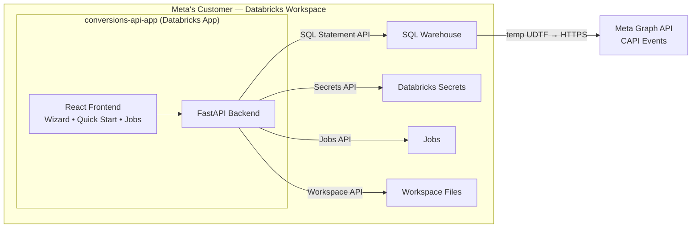
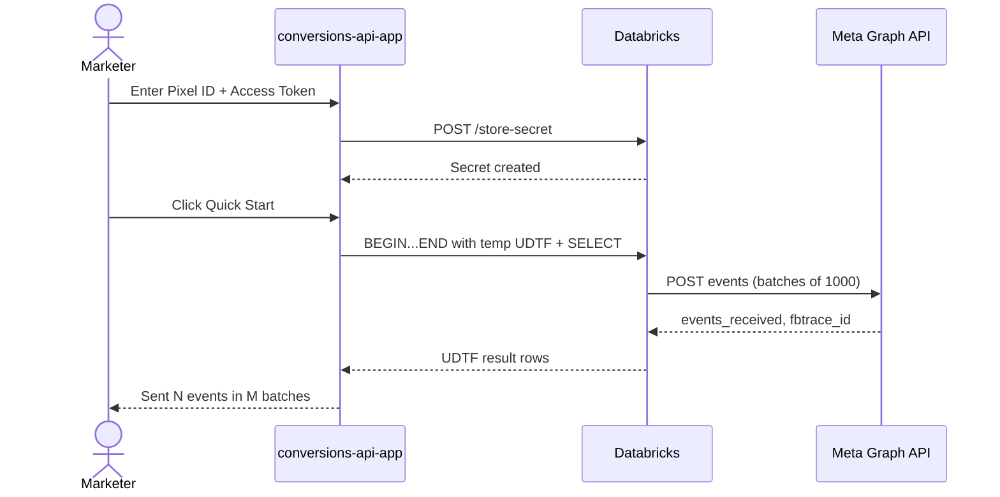
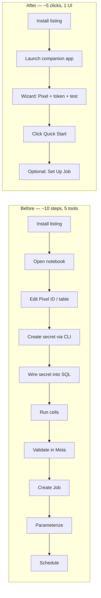

# Architecture

## CUJ framing

Before this app, a customer installing the CAPI Marketplace listing landed on a sample notebook and had to manually configure a Pixel ID, create and reference a Databricks Secret, wire the access token into a UDTF call, re-run cells, then separately stand up a Databricks Job for production use — roughly 10 steps across 5 surfaces (notebook editor, Secrets UI/CLI, SQL, Jobs UI, Meta Events Manager). Marketers and ad-ops couldn't complete this without engineering help.

This app reduces Quick Start to ~5 clicks inside a single Databricks App.

## System architecture

## Quick Start runtime flow

## CUJ reduction

## Key design decisions

### Temp UDTF inside `BEGIN...END`

Quick Start creates a session-scoped `TEMPORARY FUNCTION` with the UDTF source inlined, rather than depending on a pre-registered UC function. This removes any requirement for the user to have DDL permissions on a specific catalog or for a specific function to be pre-deployed.

The entire `CREATE TEMPORARY FUNCTION` + `DECLARE` variables + `SELECT` call goes in a single `BEGIN...END` compound statement because the SQL Statement Execution API accepts only one statement per call, and the function must live in the same session as the query that calls it.

Inside `BEGIN...END`:
- `DECLARE` (not `DECLARE OR REPLACE`) is required
- `SET` (not `SET VAR`) is required
- All `DECLARE` statements must come before any other statements

### Secrets-first, never plaintext

The access token is stored in a Databricks Secret scope during the Wizard flow. Subsequent SQL calls resolve the token via the `secret('scope', 'key')` SQL function — the Python layer never handles the plaintext value after the initial store.

### Dual-mode auth

`server/config.py` detects whether it's running inside a Databricks App (via the `DATABRICKS_APP_NAME` env var) or locally. Locally it reads from `~/.databrickscfg` profiles; in-app it uses the app's service principal, with optional forwarding of the user's identity via the `x-forwarded-access-token` header.

### Frontend build committed

`frontend/dist/` is committed to the repo so the Databricks App runtime can serve it without a build step at deploy time. This avoids needing Node installed inside the app container.

## Major alternatives considered

### Ship only the existing notebook (status quo)
Rejected. Telemetry shows 11 of ~19 install starts failing or abandoning. The notebook alone cannot serve Meta's advertiser audience.

### Build into the Marketplace listing itself (native UI)
Rejected for now. Marketplace doesn't support shipping a companion app as a first-class primitive. Labs is the correct incubator to prove the pattern before asking Product to productize.

### Rely on a Meta-built tool
Rejected. Meta's official CAPI SDKs require per-customer engineering work and don't cover the Databricks path. Databricks hosts the Marketplace listing on Meta's behalf and is best positioned to close the loop.

## Uncertainties and dependencies

- SQL Statement Execution API max `wait_timeout` is 50s; longer UDTF runs require the app to poll for statement completion (implemented).
- Databricks Apps runtime grants user API scopes only after `databricks apps update` — `create` + `deploy` alone are insufficient. See [Deployment](./deployment.md).
- Meta Graph API version (currently `v24.0`) will need periodic bumps as Meta deprecates versions. Single source of truth in `server/config.py` (`META_API_VERSION`).
- Depends on the upstream [`pyspark-udtf`](https://github.com/allisonwang-db/pyspark-udtf) OSS package for UDTF logic. The source is currently inlined into the temp function to avoid environment-install cold starts.
